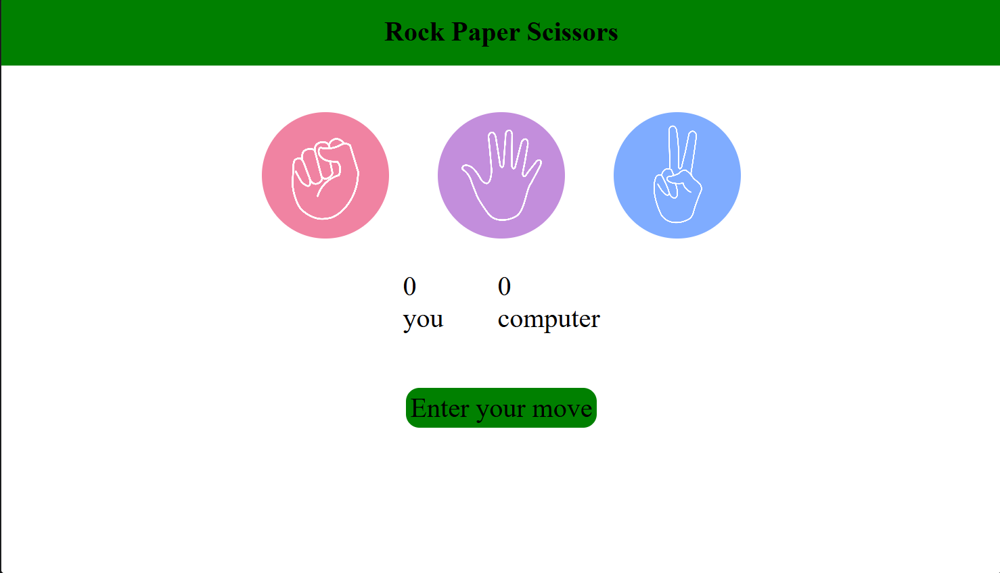

# Rock Paper Scissors

A simple Rock Paper Scissors game built using HTML, CSS, and JavaScript. The game lets the user play against the computer with a clean and responsive interface while keeping track of the score.

## Preview



## Features

- Play against the computer
- Random computer move generation
- Live score tracking
- Winner announcement after every round
- Simple and responsive UI
- Built with pure HTML, CSS, and JavaScript

## Tech Stack

- HTML5
- CSS3
- JavaScript (ES6)

## How to Run

1. Clone the repository.
2. Open the project folder.
3. Open `index.html` in your browser.

## Project Structure

```
Rock-Paper-Scissors/
│── index.html
│── style.css
│── script.js
└── Screenshot 2026-07-04 202113.png
```

## Game Rules

- Rock beats Scissors
- Scissors beats Paper
- Paper beats Rock
- If both players choose the same move, the round is a draw

## Future Improvements

- Add animations for moves
- Add sound effects
- Store scores using Local Storage
- Add difficulty levels
- Improve mobile responsiveness

## Author

Akshat Kumar